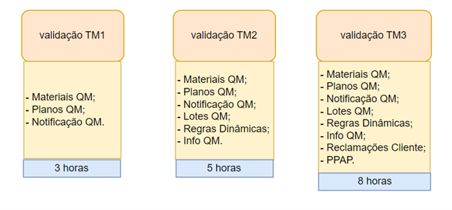
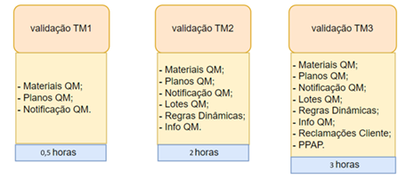

# Automatização de Validação de Dados Migrados para o Sistema (SAP)

## Problema
Validação de dados carregados no sistema SAP, excesso de tempo gasto no processo, trabalho repetitivo executado em diversas vezes em diferentes momentos do projeto. A qualidade da validação pode ser comprometida então podemos ter dados de pobre qualidade no sistema além de que pode ser necessário retrabalhos.

## Introdução
O SAP é um sistema ERP mundialmente utilizado e líder de mercado. O sistema integra as áreas de uma empresa de modo que as informações sejam compartilhadas e utilizada por todos. Ou seja, todas as informações ficam em um mesmo lugar. Isso possibilita integrar também diferentes unidades facilitando assim a gestão e tomada de decisão. 
Com a evolução do mercado e da tecnologia, a SAP atualiza seus produtos para melhor atendimento de seus clientes. A nova versão S4 Hanna é a versão mais atual do mercado e a versão anterior R3 deixará de ter suporte a partir de 2027, o que inicia o movimento das empresas da migração e atualização para a nova versão.

Com essa necessidade de atualização do sistema, a empresa seguiu a diretriz da unificação do sistema de uma forma global. Foi criado um template na dentro da nova versão e todas as plantas/ deployment devem utilizá-lo. 
Dentro desse projeto de migração, em a cada deployment é feito um fit do sistema com a nova versão, dessa forma são feitos diversos testes, regras para carga e validação de carga de dados, essas validações são em feitas três vezes, em diferentes etapas do deployment.

A validação de dado é um processo manual que necessita diversos passos repetitivos, e ações, além de permitir falha na validação por falha humana.

## Fluxograma do Processo

 

## Solução Proposta
Usar Script dentro do sistema SAP e conectá-los a documentos exportados com macros associadas, que são itens de média complexibilidade e já são itens existentes no mercado e de ferramentas de uso atual da empresa.
Será gravado nos Scripts, a extração dos dados vias tabelas do SAP, serão exportados para uma pasta local no formato Excel. Nessa mesma pasta tem os arquivos bases com fórmulas e checagens de verificação, essas verificações serão gravadas em macros. E então a Macro será executada e a validação estará pronta para ser analisada.  
As cargas de dados são validadas em três etapas conforme fluxo:

 

## Protótipo de Baixa definição
No caso não é necessário pois é script e o resultado será excel com botões de macros. Agendamento de Tarefas com gerenciador Windows.

## Aplicação Solução 
Com a aplicação da Solução pode-se perceber que a Area ficou muito satisfeita e obtivemos os seguintes resultados.
Economia no tempo de execução da tarefa que passou de 16 horas para 5,5 horas. Representando uma economia de 11 horas. Houve também a economia do tempo de Retrabalho, que pelo histórico era de 3,5 horas. Além de que aumentamos em 11% a confiabilidade dos dados que agora passam a ser de 95%.

 
## Conclusão
Conseguimos obter resultado positivos com ferramentas que já tínhamos sem necessariamente fazer investimentos.  Projeto Implementado e bem aceito.

